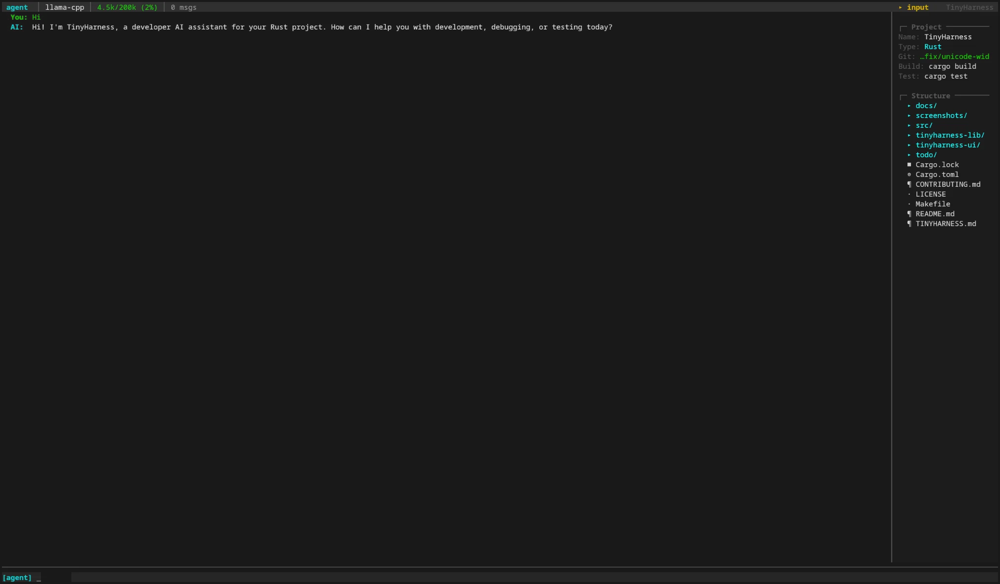

# TinyHarness

Lightweight AI assistant framework in Rust with pluggable LLM providers (Ollama, llama.cpp, vLLM), built-in tool calling, agent skills, and customizable system prompts.



## Features

- **Pluggable Providers**: Ollama, llama.cpp, vLLM, and any OpenAI-compatible API. Swap backends without changing application code. Ollama supports retries with backoff, configurable timeouts, and reasoning/think levels. ⚠️ Sockudo AI Transport is also supported as a highly experimental backend — it requires a running Sockudo server and a worker bridge (see `docs/examples/sockudo-worker/`).
- **Tool System**: 15 modular tools (`ls`, `read`, `write`, `edit`, `grep`, `glob`, `run`, `web_search`, `web_fetch`, `auto_compact`, `invoke_skill`, `switch_mode`, `question`, `screenshot`, plus the built-in `read` image loader for multimodal models).
- **Agent Modes**: Four modes — `casual` (web-only), `planning` (read-only + signals), `agent` (full access), and `research` (web-focused) — to control what the AI can do. Modes are backed by customizable `.md` prompt files.
- **Skills**: Pluggable SKILL.md modules discovered from `~/.config/tinyharness/skills/` and `.tinyharness/skills/`. Invokable by the AI via `invoke_skill` or by the user via `/use <name>`. Supports YAML frontmatter with name, description, compatibility, licensing, and model-invocation controls.
- **Context Management**: Token estimation with per-model context window sizes (8K–256K), load warnings at 70%/90% thresholds, and cascading conversation compaction via `/compact`.
- **Session Persistence**: JSONL-based sessions with UUIDs, saved in `~/.local/share/tinyharness/sessions/`. Supports session listing, switching by prefix, renaming, deletion, and auto-save every 5 messages.
- **Async Streaming**: Built on `tokio` for efficient streaming with all providers. Ctrl+C interrupts generation gracefully.
- **Experimental TUI**: Split-pane terminal UI with conversation view, sidebar, input bar, and tool output panel. Built from scratch with no external TUI framework. Activate with `--tui`. ⚠️ Experimental — may have rendering issues or incomplete features.
- **Interactive CLI**: Color-coded terminal interface with 22+ slash commands for session management, configuration, file pinning, image attachment, audit logging, and tool control.
- **Customizable Prompts**: System prompts are seeded from hardcoded defaults on first launch to `~/.config/tinyharness/prompts/` and can be freely edited.
- **Command Safety**: Smart auto-accept for safe shell commands with prefix matching, deny lists, redirection stripping, and audit logging.
- **Thinking Display**: Optionally render the model's reasoning chain inline during streaming (toggle via `/showthink`).
- **Image Attachments**: Multimodal support — attach images with `/image` and the `read` tool automatically loads image files for visual models.
- **Project Instructions**: Auto-discovers `TINYHARNESS.md`, `.tinyharness.md`, `AGENTS.md`, or `CLAUDE.md` walking up from the current directory. Configurable via `TINYHARNESS_MD_FILES` env var or settings. Additional project-specific files (e.g. `RULES.md`, `.cursorrules`) can be loaded from `.tinyharness/config.json`.
- **Per-Project Settings**: Layer `.tinyharness/config.json` over global settings. Override safe/denied commands, auto-accept behavior, context limits, preferred mode, and more per project. View merged settings with `/project-settings`.
- **Smart Language Detection**: Auto-detects 17+ languages and build tools (Rust, Zig, Deno, Bun, Swift, Ruby, Elixir, Haskell, Kotlin, .NET, Dart/Flutter, Nix, Node.js, Python, Go, Java, C/C++). Detects monorepos (e.g. "Rust + Node.js").

## Getting Started

### Prerequisites

- [Rust](https://www.rust-lang.org/tools/install) (latest stable, edition 2024)
- At least one LLM backend running locally:
  - [Ollama](https://ollama.com/) (default)
  - [llama.cpp](https://github.com/ggml-org/llama.cpp) server
  - [vLLM](https://github.com/vllm-project/vllm)
  - [Sockudo](https://github.com/sockudo/sockudo) (⚠️ highly experimental — requires a worker bridge, see `docs/examples/sockudo-worker/`)

### Installation

```bash
git clone https://github.com/yourusername/TinyHarness.git
cd TinyHarness
make install
```

This builds in release mode and copies the binary to `~/.local/bin`. Make sure `~/.local/bin` is in your `$PATH`:

```bash
export PATH="$HOME/.local/bin:$PATH"
```

To uninstall:

```bash
make uninstall
```

Alternatively, install via Cargo:

```bash
cargo install --path .
```

### Installation (Nix)

A Nix flake is provided for reproducible builds and dev environments.

**Run once without installing:**

```bash
nix run github:PTFOPlayer/TinyHarness
```

**Build the package:**

```bash
cd TinyHarness
nix build
./result/bin/tinyharness
```

**Enter a development shell** (with Rust toolchain, rustfmt, and clippy pre-configured):

```bash
nix develop
```

### Usage

**Ollama** (default):
```bash
tinyharness
```
Connects to `http://127.0.0.1:11434`. Supports configurable timeout, retries, and think/reasoning level.

**llama.cpp**:
```bash
tinyharness --llama-cpp
```
Connects to `http://127.0.0.1:8080` by default.

**vLLM**:
```bash
tinyharness --vllm
```
Connects to `http://127.0.0.1:8000` by default.

**Sockudo** (⚠️ highly experimental):
```bash
tinyharness --sockudo
```
Connects to `http://127.0.0.1:6001` by default. Requires a running Sockudo server with AI Transport enabled and a worker bridge process (see `docs/examples/sockudo-worker/`). This backend is not recommended for production use.

A health check runs on startup to verify the provider is reachable. If the saved model is unavailable, the first available model is auto-selected with a warning.

**Custom URL** (works with any provider):
```bash
tinyharness --llama-cpp --url http://localhost:2832
tinyharness --ollama --url http://192.168.1.50:11434
tinyharness --vllm --url http://gpu-server:8000
```

**Continue last session**:
```bash
tinyharness --continue
```
Resumes the most recent session in the current working directory.

**Non-interactive prompt**:
```bash
tinyharness -p "What does this project do?"
tinyharness --prompt "Explain the architecture"
```
Sends an initial prompt and then drops into the interactive loop for follow-up turns.

**Terminal UI (experimental)**:
```bash
tinyharness --tui
```
Launches a split-pane TUI with conversation view, sidebar, input bar, and tool output panel. Built from scratch using raw ANSI escape sequences — no external TUI framework. This is experimental and may have rendering issues or incomplete features.

**Interactive setup**:
```bash
tinyharness --config
```
Runs a guided setup: pick a provider, enter a URL, save to settings. Exits when done.

### CLI Arguments

| Flag | Description |
|---|---|
| `-o`, `--ollama` | Use the Ollama provider (default) |
| `-l`, `--llama-cpp` | Use the llama.cpp provider |
| `-v`, `--vllm` | Use the vLLM provider |
| `--sockudo` | Use the Sockudo AI Transport provider (⚠️ highly experimental) |
| `-u`, `--url <url>` | Custom base URL for the provider |
| `-c`, `--continue` | Continue the most recent session in the current directory |
| `--config` | Run interactive provider setup, then exit |
| `-p`, `--prompt <text>` | Start with this message, then drop into interactive mode |
| `--tui` | Launch the experimental terminal UI (split-pane TUI) |

## Agent Modes

| Mode | Tools Available | Purpose |
|------|----------------|---------|
| **casual** | `web_search`, `web_fetch` | Pure chat with web access, no filesystem access |
| **planning** | All read-only tools + signal tools | Analyze & plan, then escalate to agent |
| **agent** | All 15 tools | Full development access — code, commands, web |
| **research** | All read-only tools + signal tools | Web research, then escalate for execution |

Switch modes with `/mode <name>`, use shortcut aliases (`/plan`, `/agent`, `/research`, `/casual`), or let the AI request escalation via `switch_mode`.

## Tools

| Tool | Category | Description |
|------|----------|-------------|
| `ls` | ReadOnly | List directory contents |
| `read` | ReadOnly | Read file content (also loads images for multimodal models) |
| `grep` | ReadOnly | Search with regex across files |
| `glob` | ReadOnly | Find files by glob pattern |
| `web_search` | ReadOnly | Search the web (requires Ollama API key) |
| `web_fetch` | ReadOnly | Fetch a web page by URL |
| `write` | Destructive | Write content to a file |
| `edit` | Destructive | Edit a file by find-and-replace |
| `run` | Destructive | Execute shell commands with timeout & working directory |
| `switch_mode` | Signal | Request a mode switch |
| `question` | Signal | Ask the user a question with options |
| `auto_compact` | Signal | Request conversation compaction |
| `invoke_skill` | Signal | Activate a skill by name |
| `screenshot` | Signal | Request a screenshot from the user |

## Slash Commands

### Session Management
| Command | Description |
|---------|-------------|
| `/sessions` | List all saved sessions (most recent first) |
| `/session <id>` | Switch to an existing session by ID prefix |
| `/session delete <id\|name>` | Delete a session with confirmation |
| `/rename <name>` | Rename the current session |

### Mode & Model
| Command | Description |
|---------|-------------|
| `/mode [casual\|planning\|agent\|research]` | Show or switch agent mode |
| `/plan`, `/agent`, `/research`, `/casual` | Quick mode switch aliases |
| `/model [name]` | List available models or switch to one |

### Context & Files
| Command                | Description                                                 |
| ---------------------- | ----------------------------------------------------------- |
| `/add <path>`          | Pin a file into context                                     |
| `/drop <path>`         | Remove a pinned file from context                           |
| `/files`               | List all pinned files                                       |
| `/dropall`             | Remove all pinned files                                     |
| `/refresh`             | Re-read pinned files from disk                              |
| `/context`             | Show auto-detected project context                          |
| `/init`                | Generate or update `TINYHARNESS.md`                         |
| `/project-settings [init]` | Show or initialize per-project settings                  |

### Conversation
| Command | Description |
|---------|-------------|
| `/compact [focus]` | Summarize conversation history (with cascading for long sessions) |
| `/image [<path>\|clear\|drop <n>]` | Attach an image to the next message |

### Skills
| Command | Description |
|---------|-------------|
| `/skills` | List all available skills |
| `/skill <name>` | Show a skill's details and content |
| `/use <name>` | Activate a skill, injecting its instructions |
| `/unload <name>` | Deactivate a previously loaded skill |

### Configuration
| Command | Description |
|---------|-------------|
| `/settings [all]` | Show current configuration |
| `/command [list\|add\|rm\|deny\|undeny\|reset\|resetdeny]` | Manage auto-accepted and denied commands |
| `/apikey [key\|clear]` | Set, show, or clear the Ollama API key (needed for `web_search`) |
| `/contextlimit [tokens]` | Show or set the context warning threshold |
| `/autoaccept [on\|off]` | Toggle auto-accept for safe read-only commands |
| `/showthink [on\|off]` | Toggle display of the model's thinking/reasoning chain |
| `/timeout <seconds>` | Set Ollama request timeout (default: 5s) |
| `/retries <count>` | Set Ollama max retries (default: 3) |
| `/think [off\|low\|medium\|high]` | Set Ollama reasoning/think level |
| `/audit [last\|session\|clear]` | View command execution audit log |

### General
| Command | Description |
|---------|-------------|
| `/help` | Show available commands |
| `/clear` | Clear terminal screen |
| `/exit` or `/quit` | Exit TinyHarness |

### Command Management

The `/command` system controls which shell commands are auto-accepted:

```
/command list          # Show safe and denied commands
/command add <cmd>     # Add a command to auto-accept list
/command rm <cmd>      # Remove from auto-accept list
/command deny <cmd>    # Add to deny list (always requires confirmation)
/command undeny <cmd>  # Remove from deny list
/command reset         # Reset safe commands to defaults
/command resetdeny     # Clear the deny list
```

Safe commands include `cd`, `ls`, `grep`, `cat`, `git status`, `git diff`, `git log`, `cargo tree`, and ~40 more. Shell redirections (`2>&1`, `2>/dev/null`) are stripped before matching. The deny list takes priority — if a command matches both lists, it is denied. The `run` tool can never be auto-accepted even in auto-accept mode.

### Session Compaction

`/compact` summarizes older messages to free context space. Sessions with over 200 intermediate messages use cascading multi-stage compaction (chunking → per-stage summaries → merged final summary).

```
/compact focus on build errors and fixes
Cascading compaction: 580 intermediate messages → 3 stages (200 messages/stage)
  Stage 1/3: Compacting messages 1–200...
  Stage 2/3: Compacting messages 201–400...
  Stage 3/3: Compacting messages 401–580...
  Merging 3 summaries into final summary...
Compacted: 600 messages → 6 messages
```

On session load, TinyHarness warns if the conversation exceeds 70% or 90% of the context window, using the last known provider token count from session metadata.

## Skills

Skills are pluggable instruction modules that give the AI specialized knowledge. Each skill lives in a directory with a `SKILL.md` file.

**Discovery paths:**
- `~/.config/tinyharness/skills/<name>/SKILL.md` (personal — per-user)
- `.tinyharness/skills/<name>/SKILL.md` (project-local — per-repo)

Project skills take precedence over personal skills with the same name.

**SKILL.md format (YAML frontmatter):**
```markdown
---
name: rust-dev
description: Rust development best practices and code review guidelines
argument-hint: Rust file or module to review
compatibility: rust
disable-model-invocation: false
license: MIT
metadata:
  version: "1.0"
user-invocable: true
---

# Rust Development Skill

Always run `cargo fmt` and `cargo clippy` before suggesting changes...
```

All frontmatter fields are optional with sensible defaults. Skills over 10,000 characters are truncated (70% head / 30% tail). Use the `read` tool to view full content.

**Invoking skills:**
- AI: calls `invoke_skill` with the skill name (unless `disable-model-invocation: true`)
- User: `/use <name>` or `/skill use <name>`
- Deactivate: `/unload <name>`

Both personal and project-local skill directories are scanned at startup and accessible via `/skills`.

## Project Structure

TinyHarness is a Cargo workspace with three crates:

### Core library (`tinyharness-lib/`)

Frontend-agnostic — no terminal I/O, no ANSI codes, no rustyline.

```
tinyharness-lib/src/
├── lib.rs               Re-exports all public types
├── provider/             Provider trait + implementations
│   ├── mod.rs            Provider trait, Message types, ToolDefinition
│   ├── ollama.rs         OllamaProvider — raw SSE streaming, retries, Gemini signatures
│   ├── llama_cpp.rs      LlamaCppProvider — OpenAI-compatible
│   ├── vllm.rs           VllmProvider — OpenAI-compatible
│   ├── sockudo.rs        SockudoProvider — AI Transport via WebSocket (⚠️ highly experimental)
│   └── openai_compat.rs  Shared HTTP/SSE logic for OpenAI-compatible backends
├── config/mod.rs         Settings persistence (provider, model, mode, API key, safe/denied commands, think type)
├── mode.rs               AgentMode enum (casual/planning/agent/research) with customizable .md prompts
├── context.rs            WorkspaceContext — auto-detected project metadata + instruction file discovery
├── session.rs            JSONL session persistence with UUIDs, auto-save, atomic writes
├── token.rs              Token estimation, context window sizes (8K–256K), usage warnings
├── skill.rs              Skill discovery, registry, frontmatter parsing, indexing
├── image.rs              Image attachment handling (base64 encoding, dimension detection)
├── prompts/              Hardcoded default system prompts (header.md, casual.md, planning.md, agent.md, research.md)
└── tools/                15 tool implementations
    ├── mod.rs            ToolManager with mode-based filtering, signal event parsing
    ├── tool.rs           Tool struct, ToolCategory enum, schema builders, extract_args! macro
    ├── ls.rs             Directory listing
    ├── read.rs           File reading with image detection for multimodal models
    ├── write.rs          File writing
    ├── edit.rs           Find-and-replace file editing
    ├── grep.rs           Regex search across files
    ├── glob.rs           File glob pattern matching
    ├── run.rs            Shell command execution with timeout
    ├── web_search.rs     Web search + web fetch (Ollama cloud API)
    ├── switch_mode.rs    Mode switch signal
    ├── question.rs       User question signal
    ├── auto_compact.rs   Compaction signal
    ├── invoke_skill.rs   Skill activation signal
    └── screenshot.rs     Screenshot request signal
```

### UI library (`tinyharness-ui/`)

Terminal UI abstractions — reusable output formatting, diff display, confirmation prompts, and the experimental TUI.

```
tinyharness-ui/src/
├── lib.rs               Module declarations
├── output.rs            Structured output writer (stdout/stderr abstraction)
├── style.rs             ANSI color constants (BOLD, CYAN, RED, BG_TOOL, SPINNER_FRAMES, etc.)
├── ui/
│   ├── mod.rs            Module declarations
│   ├── confirm.rs        Tool call confirmation prompts (Yes/No/Auto-accept)
│   ├── diff.rs           Unified diff display
│   ├── input.rs          CommandHelper for rustyline tab-completion
│   └── wrap.rs           Word-wrapped output with ANSI-aware line filling
└── tui/                  ⚠️ Experimental TUI subsystem
    ├── mod.rs             TUI module declarations + agent integration types (TuiAgentEvent, TuiUserAction)
    ├── app.rs             Main TUI application loop, widget layout, event dispatch
    ├── backend.rs         Backend trait (StdioBackend + TestBackend for testing)
    ├── cell.rs            Color/style representation for the screen buffer (raw ANSI, no framework)
    ├── event.rs           Event system (keyboard, mouse, paste)
    ├── layout.rs          Rect/constraint-based layout (inspired by ratatui, from scratch)
    ├── screen.rs          Screen buffer with differential rendering, Unicode width support (CJK/combining marks)
    ├── terminal.rs        Raw terminal control, alternate screen, signal handling
    ├── widget.rs          Widget trait, Action enum, shared style helpers
    └── widgets/
        ├── conversation.rs Conversation pane (streaming text, thinking, tool calls)
        ├── input_bar.rs   Multi-line input with history, word-wrap, paste
        ├── sidebar.rs     Context panel (files, tools, mode, model info)
        ├── spinner.rs     Streaming indicator
        ├── status_bar.rs  Top bar (mode, model, token count)
        └── tool_output.rs Tool result viewer
```

### Binary crate (`src/`)

CLI application — argument parsing, agent loop, slash commands, tool dispatch, safety checking.

### Sockudo worker (`docs/examples/sockudo-worker/`)

⚠️ **Highly experimental** — example worker binary that bridges Sockudo AI Transport to Ollama. Connects to a Sockudo server via WebSocket, receives `ai-input` events, calls Ollama for inference, and streams responses back as versioned message mutations. Not part of the Cargo workspace and not required for normal TinyHarness usage with Ollama, llama.cpp, or vLLM. Build it standalone with `cargo build` from within the `docs/examples/sockudo-worker/` directory.

```
src/
├── main.rs               Entry point, CLI parsing (clap), provider creation, session init, TUI launch
├── agent/
│   ├── mod.rs            Main interaction loop, streaming response display, spinner, thinking chain
│   ├── tui_loop.rs       Background agent loop for TUI mode (communicates via channels)
│   ├── tools.rs          Tool call dispatch, confirmation, generic execution, signal handlers
│   ├── safety.rs         Shell command safety checker (prefix + deny list + redirection stripping)
│   ├── setup.rs          Interactive provider setup (--config), URL prompting
│   ├── display.rs        Context status formatting, args summaries, listing result summaries
│   └── input.rs          Multi-line input reading with continuation prompt
└── commands/
    ├── mod.rs            CommandRegistry, CommandDispatcher, build_registry() — 22+ commands
    ├── registry.rs       CommandContext, CommandResult, AsyncCommand trait, async_command! macro
    ├── apikey.rs         /apikey — Ollama API key management
    ├── audit.rs          /audit — command execution audit log
    ├── clear.rs          /clear — terminal clear
    ├── command.rs        /command — safe/denied command management
    ├── compact.rs        /compact — cascading conversation summarization
    ├── config_settings.rs /contextlimit, /autoaccept, /showthink, /timeout, /retries, /think
    ├── context.rs        /context — workspace context display
    ├── exit.rs           /exit — graceful shutdown
    ├── files.rs          /add, /drop, /files, /dropall, /refresh — file pinning
    ├── help.rs           /help — command listing
    ├── image.rs          /image — image attachment management
    ├── init.rs           /init — TINYHARNESS.md generation
    ├── mode.rs           /mode — mode switching
    ├── models.rs         /model — model listing and selection
    ├── sessions.rs       /sessions, /session — session listing, switching, deletion
    ├── settings.rs       /settings — configuration display
    └── skill.rs          /skills, /skill, /use, /unload — skill management
```

## Development

### Build & Test

```bash
cargo build                    # Debug build
cargo build --release          # Release build
cargo test --workspace         # Run all tests
cargo test -p tinyharness-lib  # Library tests only
cargo test -p TinyHarness      # Binary tests only
cargo test <test_name>         # Run a specific test
cargo clippy --workspace -- -D warnings   # Lint
cargo fmt --all -- --check     # Format check
cargo fmt --all                # Auto-format
```

If you're using the Nix flake, prefer:

```bash
nix build                      # Build the package
nix flake check                # Run all checks (build + fmt + clippy --deny warnings + test)
nix develop                    # Enter dev shell with cargo/rustfmt/clippy
```

### Verification Steps

After making changes, run:

1. `cargo fmt --all` — ensure formatting is clean
2. `cargo clippy --workspace -- -D warnings` — no clippy warnings
3. `cargo test --workspace` — all tests pass
4. `cargo build` — clean debug build succeeds

## AI Usage & Security

TinyHarness grants LLMs the ability to interact with your filesystem through tool calling. This introduces specific risks:

- **Sandboxing**: Run within a sandboxed environment (Docker container, VM) to prevent unintended modifications.
- **Non-determinism**: LLMs may hallucinate or produce incorrect tool arguments. Always review proposed actions.
- **Accountability**: You assume full responsibility for all operations performed by the AI. Ensure you have backups.

The `run` tool can never be auto-accepted — even with auto-accept mode (`a`) — unlike `write` and `edit`. Safe commands (e.g., `ls`, `git status`) can be auto-accepted when `/autoaccept` is on.

## Project Instructions (TINYHARNESS.md)

TinyHarness automatically discovers project instruction files, similar to `CLAUDE.md` in Claude Code and `AGENTS.md` in other agents. These files give the AI persistent context about your project.

### Discovery

Searches from the current directory up to the filesystem root (first match wins). The discovery order is configurable via settings or an environment variable.

**Default priority order:**

| Priority | File | Notes |
|---|---|---|
| 1 | `TINYHARNESS.md` | TinyHarness-native |
| 2 | `.tinyharness.md` | Hidden variant |
| 3 | `AGENTS.md` | Industry standard (60K+ repos) |
| 4 | `CLAUDE.md` | Claude Code compatibility |

**Customizing the discovery list:**

```bash
# Env var override (highest priority):
export TINYHARNESS_MD_FILES="CLAUDE.md,TEAM_RULES.md"
tinyharness
```

Or in `~/.config/tinyharness/settings.json`:
```json
{
  "project_md_files": ["CLAUDE.md", ".cursorrules", "TEAM_RULES.md"]
}
```

**Additional per-project files** can be loaded via `.tinyharness/config.json`:
```json
{
  "project_md_files": ["RULES.md", "DEPLOYMENT.md"]
}
```
These are appended after the main instruction file in the AI's context.

Files over 20,000 characters are truncated (70% head / 30% tail with a marker).

### Generating with `/init`

Run `/init` in a TinyHarness session and the AI will analyze your project and generate a `TINYHARNESS.md`:

```
[agent]> /init
  Generating project instruction file...
  ✦ Created /path/to/TINYHARNESS.md (45 lines)
```

If one already exists, `/init` updates it — keeping accurate parts, removing outdated ones, and adding what's missing.

### What to Include

A good instruction file should contain what you'd tell a new teammate:

- **Build and test commands** — specific ones, not vague
- **Code conventions** — rules that differ from defaults
- **Architecture** — key directories and module relationships
- **Known gotchas** — things that trip up newcomers
- **Verification steps** — what to run after making changes

Keep it concise (under 200 lines). For detailed reference, the AI can use `read` on specific files.

## Per-Project Settings

TinyHarness supports per-project configuration via `.tinyharness/config.json`, discovered by walking up from the current working directory (same algorithm as instruction file discovery). Settings are layered:

```
~/.config/tinyharness/settings.json          (global)
  → .tinyharness/config.json                  (project override)
    → CLI flags                               (highest priority)
```

### Supported fields

```json
{
  "safe_command_prefixes": ["python -m pytest", "npm run lint"],
  "denied_command_prefixes": ["git push --force"],
  "auto_accept_safe_commands": false,
  "context_limit": 32768,
  "project_md_files": ["RULES.md", ".cursorrules"],
  "preferred_mode": "agent"
}
```

- **`safe_command_prefixes`**: Extends (not replaces) the global safe list
- **`denied_command_prefixes`**: Replaces the global deny list entirely
- **`auto_accept_safe_commands`**: Overrides global toggle
- **`context_limit`**: Overrides context warning threshold
- **`project_md_files`**: Additional instruction files loaded after the main one
- **`preferred_mode`**: Default agent mode for this project

### Managing project settings

```
/project-settings             # Show merged settings with source annotations
/project-settings init        # Generate a commented .tinyharness/config.json template
```

Sources are displayed as `(project)`, `(global)`, or `(default)`, making it clear where each value originates.

## Language Detection

TinyHarness auto-detects your project's language and build tool from marker files in the workspace root. Detection supports 17+ languages and can identify multiple languages in monorepos (e.g. "Rust + Node.js").

### Supported languages

| Language | Detection files |
|----------|----------------|
| Rust | `Cargo.toml` |
| Zig | `build.zig`, `build.zig.zon` |
| Deno | `deno.json`, `deno.jsonc` |
| Bun | `bun.lockb`, `bun.lock` |
| Swift | `Package.swift` |
| Ruby | `Gemfile` |
| Elixir | `mix.exs` |
| Haskell | `stack.yaml`, `*.cabal` |
| Kotlin | `build.gradle.kts`, `settings.gradle.kts` |
| .NET | `*.csproj`, `*.sln` |
| Dart/Flutter | `pubspec.yaml` |
| Nix | `flake.nix`, `default.nix` |
| Node.js | `package.json` |
| Python | `pyproject.toml`, `setup.py`, `setup.cfg`, `requirements.txt` |
| Go | `go.mod` |
| Java (Gradle) | `build.gradle` |
| Java (Maven) | `pom.xml` |
| C/C++ (CMake) | `CMakeLists.txt` |

Unknown project types fall back to `Makefile` or `Justfile` hints when available. Detected commands are injected into the system prompt so the AI knows how to build and test your project without being told.
